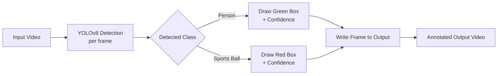

# Football Player & Ball Detection

Detects players and the ball in football match footage using YOLOv8 — draws live bounding boxes and confidence scores over every frame of the video.


---

## What it does



The script reads a football video frame by frame, runs YOLOv8 object detection on each frame, and draws:
- 🟩 **Green boxes** around players
- 🟥 **Red boxes** around the ball

Both with live confidence scores, then writes everything to a new output video.

## Demo

`demo/input.mp4` → `demo/output.mp4`

The output video shows real detection results on real match footage — every player and the ball tracked frame by frame.


https://github.com/user-attachments/assets/9ebbeac0-152b-4e16-a733-8914283aa4e7


## Quick Start

```bash
git clone https://github.com/<your-username>/football-detection.git
cd football-detection

pip install -r requirements.txt

python track_football.py
```

The YOLOv8n model weights download automatically on first run via Ultralytics.

To run on your own footage, edit the `video_path` variable in `track_football.py` to point to your video file.

## How it works

- Uses **YOLOv8n**, pretrained on the COCO dataset, which already includes `person` and `sports ball` as detectable classes — no custom training required
- Processes video frame-by-frame with OpenCV
- Filters detections to just the two relevant classes and draws labeled bounding boxes
- Outputs a fully annotated video at the same resolution and frame rate as the input

## Notes & Possible Improvements

This is a detection pipeline, not a tracker — each frame is detected independently, so there's no persistent player ID across frames yet. A natural next step would be adding object tracking (e.g. ByteTrack or DeepSORT) on top of the detections to follow individual players and the ball across the whole clip.

## Tech Stack

`Python` · `YOLOv8 (Ultralytics)` · `OpenCV` · `PyTorch`

## License

MIT — see [LICENSE](LICENSE).
